<p align="center">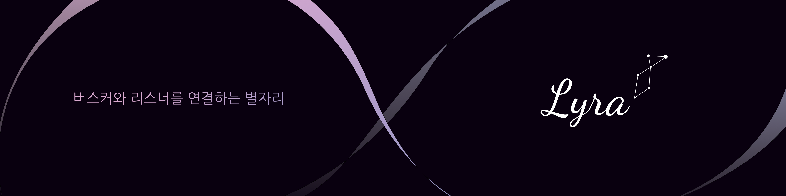</p>

<br>

### ⭐ 팀 소개

##### ⚡ 팀 Hermes

<table>
<thead>
<tr>
<th><g-emoji class="g-emoji" alias="smiling_face_with_sunglasses" fallback-src="https://github.githubassets.com/images/icons/emoji/unicode/1f60e.png">😎</g-emoji>윤주혜/팀장</th>
<th><g-emoji class="g-emoji" alias="winking_face" fallback-src="https://github.githubassets.com/images/icons/emoji/unicode/1f609.png">😉</g-emoji>임윤혁/팀원</th>
<th><g-emoji class="g-emoji" alias="woozy_face" fallback-src="https://github.githubassets.com/images/icons/emoji/unicode/1f974.png">🥴</g-emoji>정혜령/팀원</th>
<th><g-emoji class="g-emoji" alias="beaming_face_with_smiling_eyes" fallback-src="https://github.githubassets.com/images/icons/emoji/unicode/1f601.png">😁</g-emoji>진주현/팀원</th>
<th><g-emoji class="g-emoji" alias="face_savoring_food" fallback-src="https://github.githubassets.com/images/icons/emoji/unicode/1f60b.png">😋</g-emoji>문유주/팀원</th>
<th><g-emoji class="g-emoji" alias="grinning_squinting_face" fallback-src="https://github.githubassets.com/images/icons/emoji/unicode/1f606.png">😆</g-emoji>조영훈/팀원</th>
</tr>
</thead>
<tbody>
<tr>
<td></td>
<td></td>
<td></td>
<td></td>
<td></td>
<td></td>
</tr>
<tr>
<td>Frontend</td>
<td>Frontend</td>
<td>Frontend</td>
<td>Frontend</td>
<td>Backend</td>
<td>Backend</td>
</tr>
</tbody>
</table>
<br>

### ⭐ 프로젝트 소개

#### ✨ 개발 기간

-   2022.10.10 ~ 2022.11.18 (6주)
<br>

#### ✨ 기획 배경

-   길거리에서 쉽게 찾아볼 수 있는 버스킹이지만 무명 가수들이 적극적으로 자신을 알리고 버스킹 관객을 모을 수 있는 홍보 수단이 부족합니다.
-   팬데믹시대를 지나며 오프라인 관객들이 소통의 활력을 찾는데 어려움을 겪고 있습니다.
-   현금 없는 사회로 인해 공연료를 주고 받기 어려워졌으며 이는 예술가들의 자립 생태계에도 영향을 미칩니다.


<br>

#### ✨ 서비스 소개

-   모두를 연결하는 버스킹 앱 리라입니다.
    -   리라: 한국말로 거문고 별자리, 고대 그리스·로마 신화에서 헤르메스 신이 발명해 음악의 신 아폴론에게 주었다고 알려진 악기
-   다크모드 중심의 세가지 색상을 메인컬러로 설정했습니다.
    -   버스커가 밤 하늘의 빛나는 별이 되길 바라는 마음에서 밤하늘과 닮은 컨셉을 적용
	 <p align="center">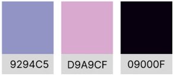</p>
- 버스커는 피드를 통해 버스킹을 홍보하고 스트릿을 통해 공연 현황을 알릴 수 있습니다.
- 관객은 그룹 채팅을 통해 버스커와 다른 관객과 상호작용할 수 있습니다.


<br>

#### ✨ 기술 스택
<div align=left>
  <table>
    <tr>
        <td><b>Back-end</td>
        <td>
          
          
          
          <br>
          
          
          
          
        </td>
    </tr>
    <tr> 
      <td><b>Front-end</td>
      <td>
      
      
      
      
      
      
      
      <br>
      </td>
    <tr>
    <td><b>Tools</td>
      <td>
      
        
      
      
      
      
      
		
		
      </td>
    </table>  
  </div>

##### ✔Socket.io

- WebSocket을 Node.js에서 쉽게 사용할 수 있도록 해주는 모듈입니다.
- express로 서버를 구현하고 브라우저와 서버 간의 실시간 양방향 이벤트로 다중 채팅을 구현합니다.

##### ✔ ReactQuery

- 캐싱을 효율적으로 관리하기 위해 도입했습니다.
- 데이터 업데이트 시 최대한 빨리 반영할 수 있습니다.
- 페이징 처리, 지연 로딩의 성능을 최적화합니다.

##### ✔ AWS S3

- 클라우드 컴퓨팅에서의 스토리지 서비스 이용으로 확장 가능한 파일 저장 공간 구성했습니다.

##### ✔ Firebase

- FCM 토큰 발급으로 디바이스를 식별했습니다.
- 플랫폼 환경에 종속되지 않고 메시지를 실시간 처리합니다.

<br>

#### ✨ 기능 소개
##### ✔ MAP

<table>
<tr>
<td>
- 위치 기반 내 주변 공연을 탐색합니다.
</td>
</tr>
<tr>
<td>
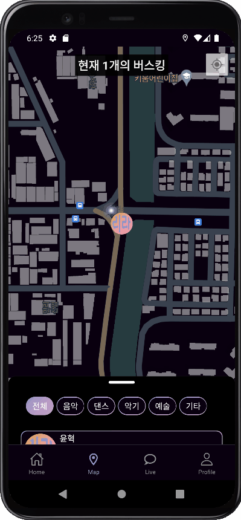
</td>
</tr>
</table>

##### ✔ PHEED

<table>
<tr>
<td>
- 피드에 받아보고 싶은 장소를 설정합니다.
</td>
<td>
- 피드를 작성해 내 버스킹을 홍보할 수 있습니다.
</td>
<td>
- 내 버스킹 현황을
  <br>
  스트릿(짧은 동영상 컨텐츠)으로
  <br>
  나타낼 수 있습니다.
</td>
</tr>
<tr>
<td>
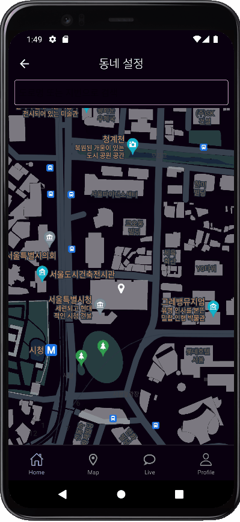
</td>
<td>

</td>
<td>

</td>
</tr>
</table>


##### ✔ LIVE

<table>
<tr>
<td>
- 내 버스킹의 그룹채팅을 생성할 수 있습니다.
</td>
<td>
- 버스킹에 참여중인 사람들 간 그룹 채팅을 할 수 있습니다.
</td>
</tr>
<tr>
<td>
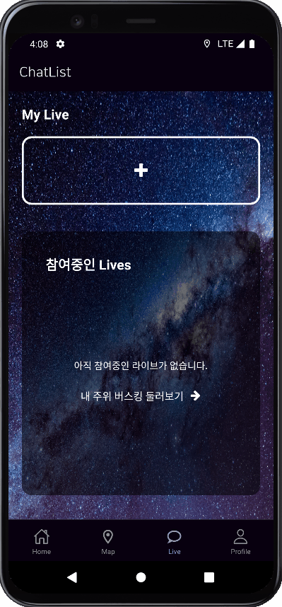
</td>
<td>
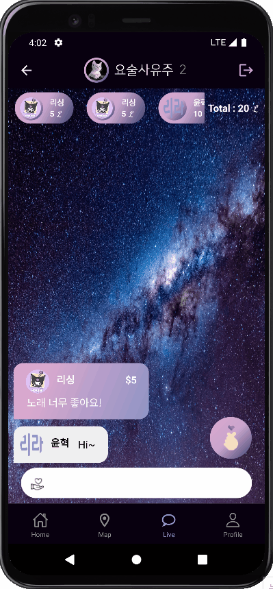
</td>
</tr>
<tr>
<td>
- 채팅창 내에서 하트로 반응할 수 있습니다.
</td>
<td>
- 채팅창 내에서 블록체인 토큰을 후원할 수 있습니다.
</td>
</tr>
<tr>
<td>
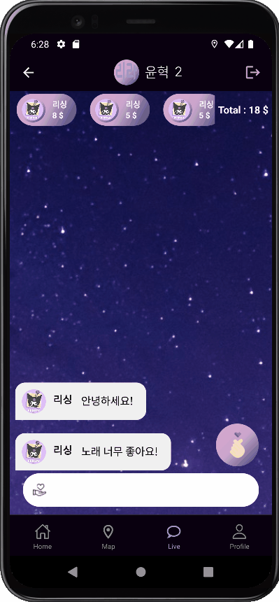
</td>
<td>
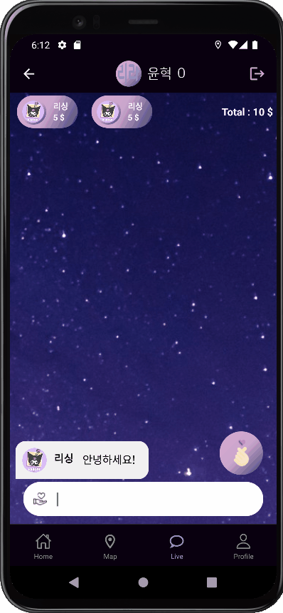
</td>
</tr>
</table>

##### ✔ MYPAGE

<table>
<tr>
<td>
- 지갑(후원, 충전) 현황을 확인할 수 있습니다.
</td>
<td>
- 나의 버스킹, 내가 좋아요 한 버스킹 등을
  <br>
  확인할 수 있습니다.
</td>
</tr>
<tr>
<td>
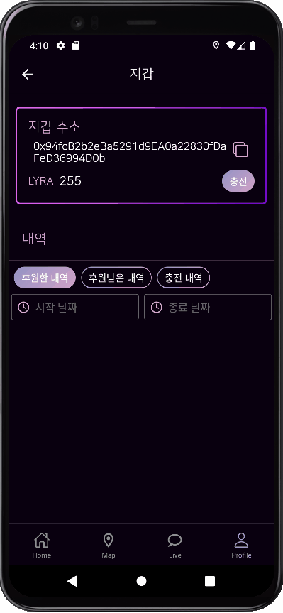
</td>
<td>
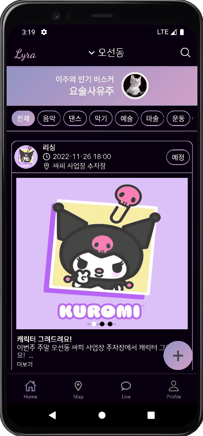
</td>
</tr>
</table>

##### ✔ SEARCH

<table>
<tr>
<td>
- 제목&내용, 태그, 유저 등을 검색 할 수 있습니다.
</td>
</tr>
<tr>
<td>

</td>
</tr>
</table>

##### ✔ ALARM

<table>
<tr>
<td>
- 앱 실행중이 아닐 때
  <br>
  내가 좋아요 한 피드의 버스킹이 시작되면
  <br>
  Push Alarm을 받아볼 수 있습니다.
</td>
<td>
- 앱 실행중일 때
  <br>
  내가 좋아요 한 피드의 버스킹이 시작되면
  <br>
  Alarm을 받아볼 수 있습니다.
</td>
</tr>
<tr>
<td>
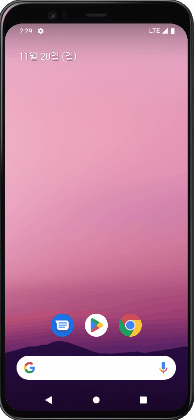
</td>
<td>
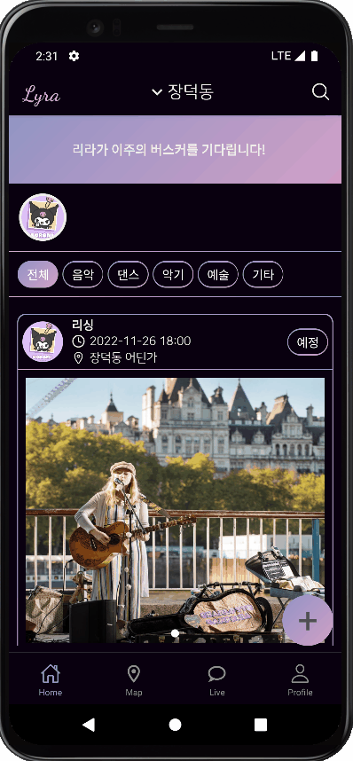
</td>
</tr>
</table>

<br>

### ⭐ 프로젝트 구성
#### ✨ ERD
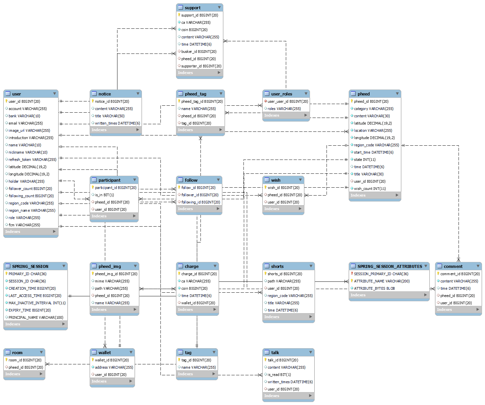

<br>

#### ✨ 와이어프레임


<br>

#### ✨ 서비스 아키텍처
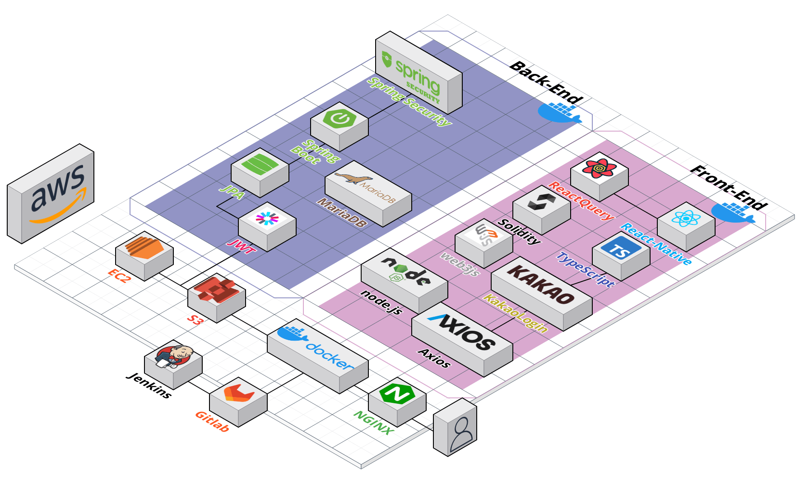

<br>

#### ✨ 폴더 구조
- Backend
```
Lyra
├─.gradle
│  ├─7.5.1
│  │  ├─checksums
│  │  ├─dependencies-accessors
│  │  ├─executionHistory
│  │  ├─fileChanges
│  │  ├─fileHashes
│  │  └─vcsMetadata
│  ├─buildOutputCleanup
│  └─vcs-1
├─.idea
├─build
│  ├─classes
│  │  └─java
│  │      └─main
│  │          └─hermes
│  │              └─Lyra
│  │                  ├─config
│  │                  ├─controller
│  │                  ├─domain
│  │                  │  └─Repository
│  │                  ├─dto
│  │                  │  ├─RequestDto
│  │                  │  └─ResponseDto
│  │                  ├─error
│  │                  │  └─Exception
│  │                  │      └─custom
│  │                  ├─Service
│  │                  └─vo
│  ├─generated
│  │  └─sources
│  │      ├─annotationProcessor
│  │      │  └─java
│  │      │      └─main
│  │      └─headers
│  │          └─java
│  │              └─main
│  ├─resources
│  │  └─main
│  └─tmp
│      └─compileJava
├─gradle
│  └─wrapper
└─src
    ├─main
    │  ├─java
    │  │  └─hermes
    │  │      └─Lyra
    │  │          ├─config
    │  │          ├─controller
    │  │          ├─domain
    │  │          │  └─Repository
    │  │          ├─dto
    │  │          │  ├─RequestDto
    │  │          │  └─ResponseDto
    │  │          ├─error
    │  │          │  └─Exception
    │  │          │      └─custom
    │  │          ├─Service
    │  │          └─vo
    │  └─resources
    └─test
        └─java
            └─hermes
                └─Lyra
```
- Frontend
```
Frontend
├─.bundle
├─android
│  ├─app
│  │  └─src
│  │      ├─debug
│  │      │  └─java
│  │      │      └─com
│  │      │          └─frontend
│  │      └─main
│  │          ├─assets
│  │          │  └─fonts
│  │          ├─java
│  │          │  └─com
│  │          │      └─frontend
│  │          │          └─newarchitecture
│  │          │              ├─components
│  │          │              └─modules
│  │          ├─jni
│  │          └─res
│  │              ├─drawable
│  │              ├─layout
│  │              ├─mipmap-hdpi
│  │              ├─mipmap-mdpi
│  │              ├─mipmap-xhdpi
│  │              ├─mipmap-xxhdpi
│  │              ├─mipmap-xxxhdpi
│  │              └─values
│  └─gradle
│      └─wrapper
├─api
├─assets
│  ├─fonts
│  └─image
├─components
│  ├─Chat
│  ├─Map
│  ├─Navigation
│  │  └─TopNavBar
│  ├─Pheed
│  │  └─Category
│  ├─Profile
│  │  ├─EditProfile
│  │  ├─Follower
│  │  ├─MyPage
│  │  └─Wallet
│  └─Utils
├─constants
├─hooks
├─ios
│  ├─assets
│  │  └─fonts
│  ├─Frontend
│  │  └─Images.xcassets
│  │      └─AppIcon.appiconset
│  ├─Frontend.xcodeproj
│  │  ├─project.xcworkspace
│  │  │  └─xcshareddata
│  │  └─xcshareddata
│  │      └─xcschemes
│  ├─Frontend.xcworkspace
│  └─FrontendTests
├─screens
│  ├─Chat
│  ├─Home
│  │  ├─Pheed
│  │  └─Shorts
│  ├─Map
│  ├─Others
│  └─Profile
├─store
└─__tests__
```
<br>
